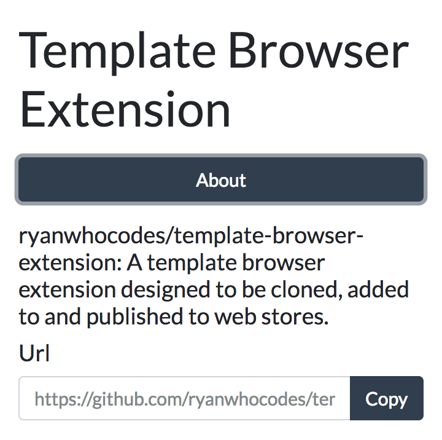

# Template Browser Extension

A template browser extension. This designed to be a quick way to setup a browser extension, which can be used by loading locally or publishing the the Chrome Web Store or Firefox Add-ons store.

### Tutorial

Read my post on Medium that explains more about how to create a browser extension.  

- [How to make a cross-browser extension using JavaScript and browser APIs](https://medium.freecodecamp.org/how-to-make-a-cross-browser-extension-using-javascript-and-browser-apis-355c001cebba)


### Save locally on your computer and run extension

- Open your terminal
- cd to a directory where you want to save this
- run: `git clone git@github.com:ryanwhocodes/template-browser-extension.git`
- Then open the browser you wish to use it in and follow the below instructions

#### Chrome
- Visit `chrome://extensions/` in your Chrome browser
- Click `Load Unpacked`
- Select the folder you saved this in

#### Firefox
- Visit `about:debugging`
- Click on `Load Temporary Add-on`
- Select the folder you saved this in

The extension can then be viewed by clicking the icon in the address bar.



### Files to edit to create your extension

The extension project structure looks like this:

```
extension
├── css
│   └── style.css
├── js
│   └── popup.js
├── manifest.json
└── popup.html
```

- `popup.html` is the popup that appears when you click the extension icon in the browser's toolbar
- `jspopup.js` is the JavaScript file that will run when the extension icon is clicked. This already has some functions to copy to the clipboard, to interact with the browser's tabs (depending on whether the browser is Chrome or not), and add event listeners.
- `css/style.css` is the css file for your popup page
- `manifest.json` update this with the configuration for your extension. If you want to add icons then you need to add them in an icons folder and then specify them here.
- Add any other theme you want for Bootstrap easily by adding it to the `css/themes` folder and then link to that in `popup.html`

### Publishing your extension

- [Publish in the Chrome Web Store - Google Chrome](https://developer.chrome.com/webstore/publish)
- [Developer Hub :: Add-ons for Firefox](https://addons.mozilla.org/en-US/developers/)

### Libraries used

- [lgarron/clipboard-polyfill: Sane copying on the web.](https://github.com/lgarron/clipboard-polyfill)
- [Bootstrap · The most popular HTML, CSS, and JS library in the world.](https://getbootstrap.com/)
- [jQuery](https://jquery.com/)
- [Bootswatch.com theme Flatly](https://bootswatch.com/flatly/)

### Mozilla and Chrome guides

The following pages were helpful when creating a web extension.

- [What are extensions? - Google Chrome](https://developer.chrome.com/extensions)
- [Anatomy of an extension - Mozilla MDN](https://developer.mozilla.org/en-US/Add-ons/WebExtensions/Anatomy_of_a_WebExtension)
- [Your first extension - Mozilla MDN](https://developer.mozilla.org/en-US/Add-ons/WebExtensions/Your_first_WebExtension)
